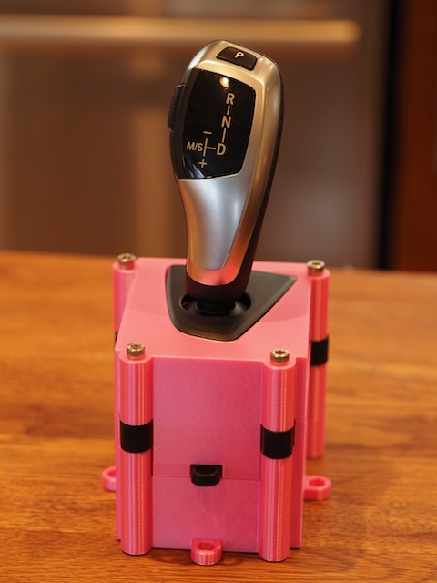
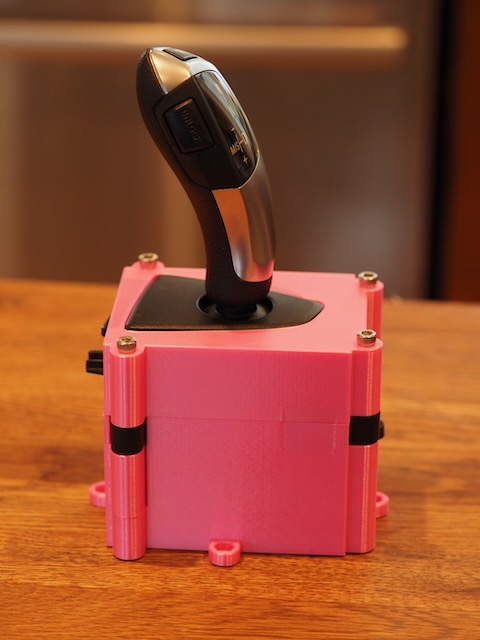

  

# Initial V

Initial V is a BMW shifter that has been converted to a Bluetooth keyboard.
In this repository, you'll find [schematics and PCB designs](pcb), [stl files](housing),
[a Vim plugin](vim-plugin), and [client software](client) for turning a BMW
shifter in to a Bluetooth keyboard that can control Vim.

Think of this project as a very over-engineered [Vim clutch](https://github.com/alevchuk/vim-clutch).

## What does it do?

Initial V is a Bluetooth Keyboard specialized for controlling Vim.
The key presses sent depend on Vim's state.
The table below describes the key presses for each handle position according to the state of the editor:

|             |  Park  |  Up  | Down | Double Up | Double Down | Move Left | Left Up | Left Down | Move Right (back to center) |
|-------      |--------|------|------|-----------|-------------|-----------|---------|-----------|------------|
| Normal Mode | `:w` on a modified buffer, `:wq` on unmodified buffer | Up key | Down key | `i` | `o` | `CTRL-V` | Up Key | Down key | `ESC` |
| Insert Mode | `ESC` | Up key | Down key | Page Up | Page Down|           |         |           |            |

"Drive" on the handle means "Normal Mode" in Vim.  "Neutral" on the handle means "Insert Mode" in Vim.
It's not possible to move the handle to the left when the handle is in Neutral mode, so there are no key combinations.
I'm not sure what mode in Vim would map to Reverse on the handle, so there's no way to transition to Reverse at the moment.

Saving a buffer in Normal mode will put the handle in to the "Park" position.
The Park position behaves the same way as Drive (Normal mode in Vim) except that if you hit Park again, it will exit Vim.

## Hardware Design

The BMW handle communicates via [CAN bus](https://en.wikipedia.org/wiki/CAN_bus).
The PCB uses an ESP-MINI-1 chip with Bluetooth capabilities, and an [SN65HVD230D](https://www.digikey.com/en/products/detail/texas-instruments/sn65hvd230d/1574496) for CAN bus communication.
The handle runs on 12v, so I used a [MPM3610GQV buck converter](https://www.digikey.com/en/products/detail/monolithic-power-systems-inc/MPM3610GQV-Z/5292909) to step the voltage down to 3.3v for the ESP.

I must give a huge thanks to [@projectgus](https://aus.social/@projectgus) for [decoding the CAN bus data](https://www.projectgus.com/2022/06/bmw-f-series-gear-selector-part-one-failures/).
This project would not be possible without their hard work.

## Software Design

The handle appears as a Bluetooth keyboard to the operating system, but it in order to change the handle state we require a way to communicate data back to the handle.
I used HID data APIs to send bytes back to the handle, requesting the handle to change state.
There is a client written in Zig [here](client), and also a Ruby client [here](firmware/ctrl.rb).
Finally, I wrote a [Vim plugin](vim-plugin) that sends commands to the handle whenever Vim changes modes.
This means that the handle will maintain state along with Vim's state even if the user changes state via keyboard (like hitting `i` on their keyboard, etc).

The general flow is (from Normal mode):

1. Double shift the handle up to send `i`
2. Vim goes in to insert mode which triggers the Inivial V Vim plugin
3. The Vim plugin requests the handle change state
4. The handle changes state

## End

I had a ton of fun building this project.  I will update each directory with a README for more detailed build instructions.  I'm also going to make a promotional video as well, but I felt I needed to fill out the README since the project is public at this point anyway!!
